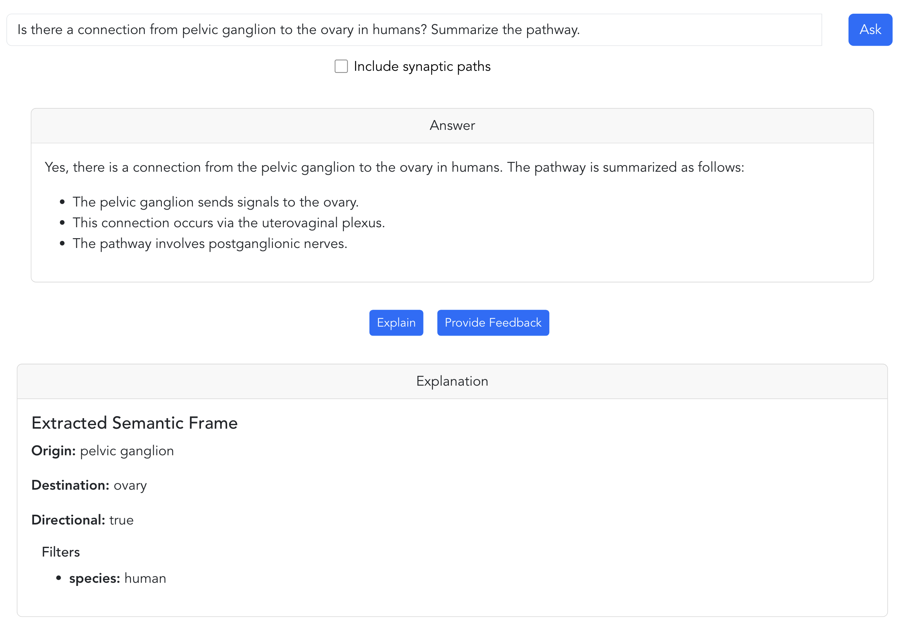
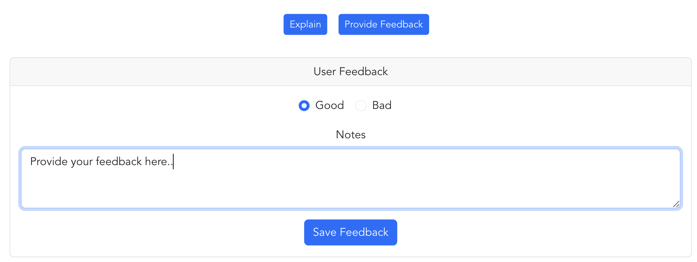
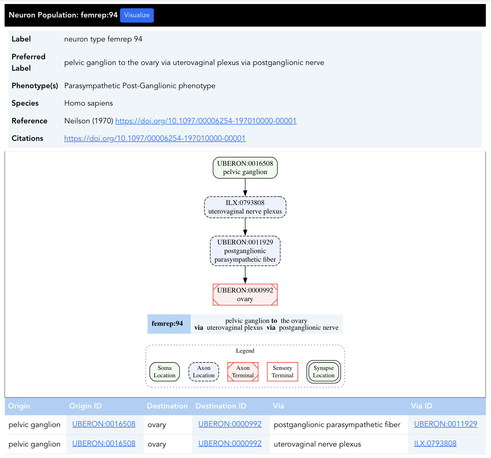
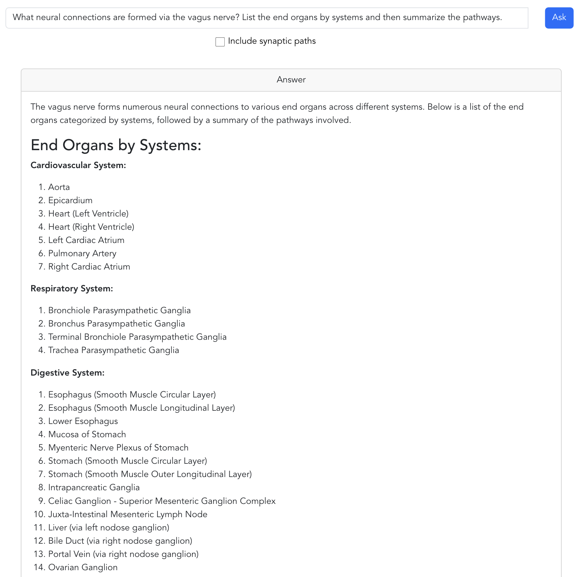
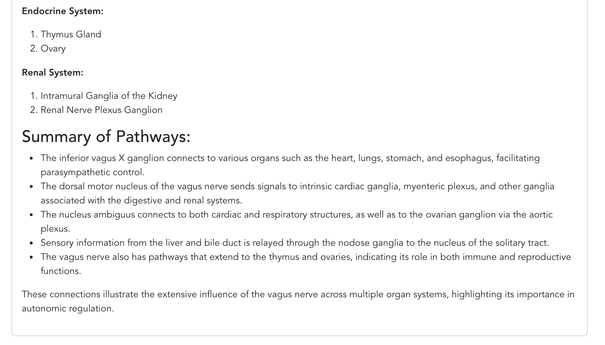
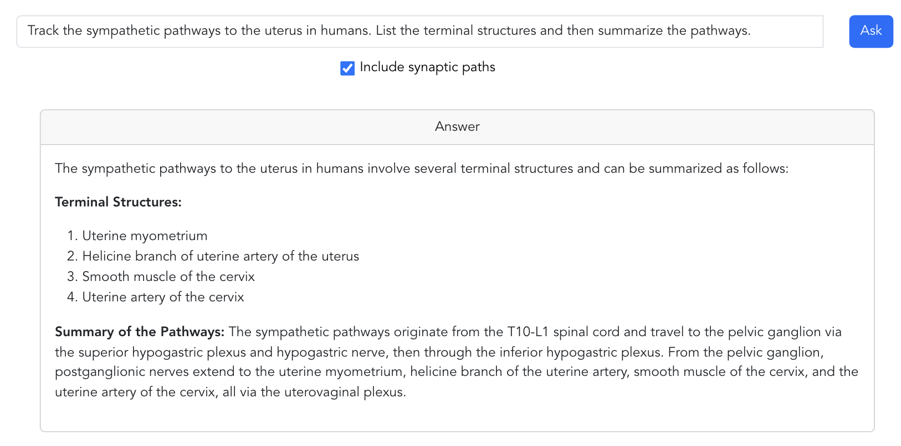
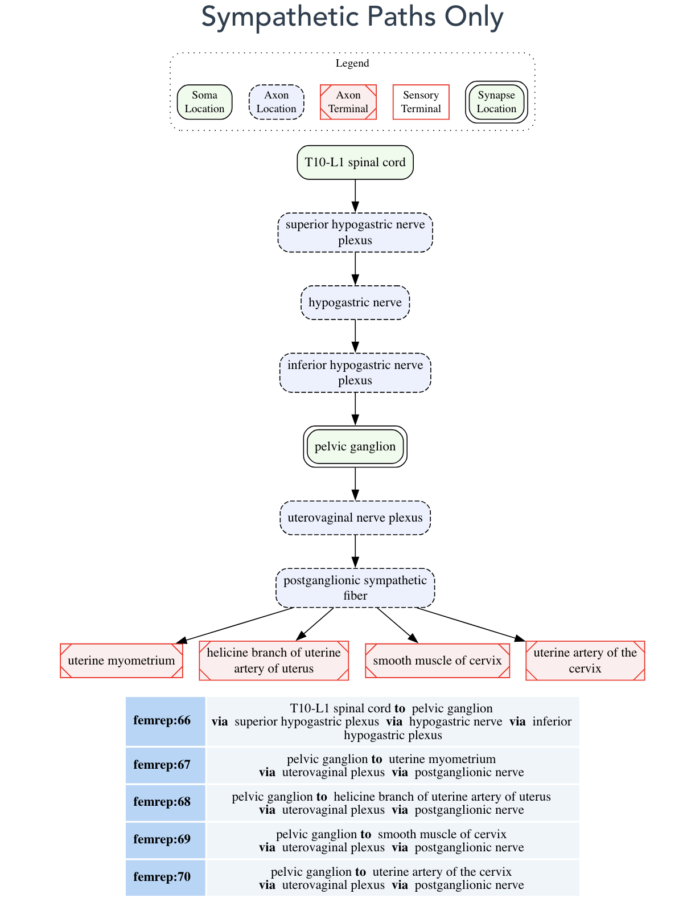
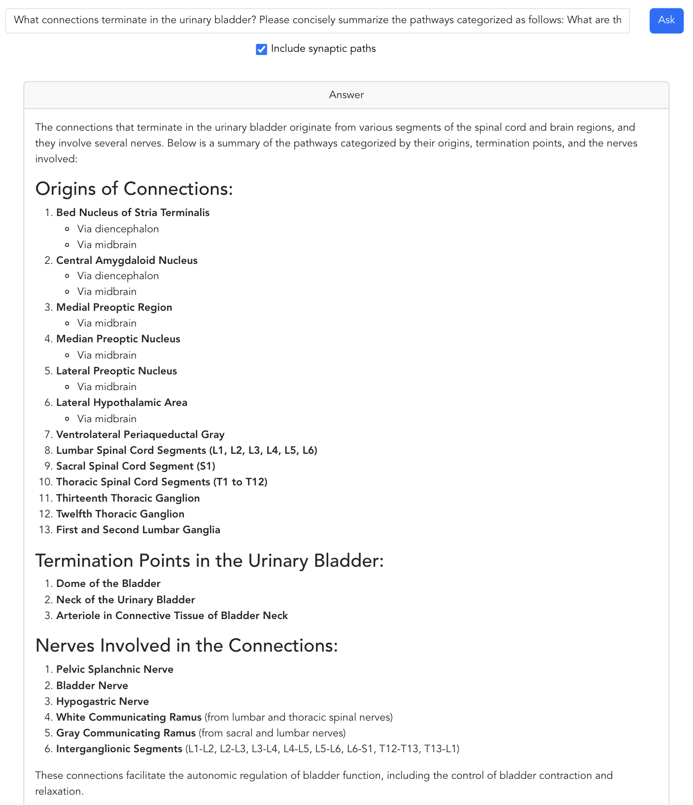
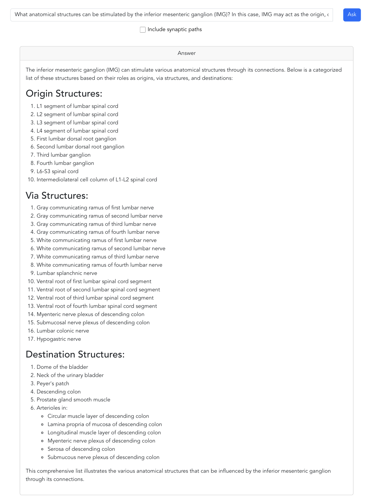

# SCKAN Natural Language Interface (SCKAN NLI)

## Introduction

The [SCKAN](https://sparc.science/tools-and-resources/6eg3VpJbwQR4B84CjrvmyD) Natural Language Interface (SCKAN NLI, [http://fdi-nlp.ucsd.edu/](http://fdi-nlp.ucsd.edu/)) is an AI-based query interface designed to retrieve high-level connectivity knowledge from SCKAN. It employs few-shot learning with the GPT-4 (GPT-4o mini) model to extract potential semantic frames related to neuronal parts from natural language expressions. Based on these extracted frames, the NLI formulates and executes queries against SCKAN using the SCKAN-Explorer API. It then applies zero-shot learning to generate answers in context with the user’s question. Leveraging a Retrieval-Augmented Generation (RAG) technique, the NLI synthesizes responses based on the retrieved data from SCKAN, thereby enhancing both relevance and accuracy. To learn more about the technical aspects of SCKAN NLI, please visit the [technical overview page](./technical-overview.md).

## Disclaimers

* SCKAN-NLI is a prototype system developed as part of a feasibility study. Response times may be slow, as this experimental service relies on GPT-4. Over 95% of the total response time is attributed to delays from the GPT-4 model.
* Response times for query answering may be even slower for questions that result in large neuronal connectivity graphs. This is due to the increased size of the context provided to GPT-4 and the corresponding size of the generated output. Autoregressive language models like GPT-4—which is estimated to have over a trillion learnable parameters—generate output on a per-token basis given the input context. SCKAN NLI requires multiple, necessarily sequential, calls to the GPT-4 API to produce a complete response to a user’s question.

## What We Are Asking

### Try it out

* Try the example prompts from the next section and verify the textual answers generated by SCKAN NLI.
* You can compare these answers with the table-formatted results based on SCKAN Explorer, which appear right after the generated responses.

### Provide feedback

* Share your feedback based on how well SCKAN NLI responds to your prompts.
* The first example in the next section includes a screenshot showing how to provide feedback.

### Suggest new features or question types

* SCKAN NLI currently supports extracting connectivity knowledge from SCKAN based on the **origin**, **destination**, or **via** locations mentioned in your natural language questions. It also supports filtering results by species, sex, and other phenotypes like the subdivisions of autonomic nervous system e.g., sympathetic or parasympathetic pathways. We plan to add more filters as we learn about new use cases.
* You can suggest new question types as part of your feedback. To do so:

  1. Type your example question.
  2. Click the **ASK** button.
  3. Then click the **Provide Feedback** button.

## How to Ask Questions and Provide Feedback

* Type a connectivity-related question as you would in ChatGPT, then click the **ASK** button. While typing, you'll receive autocomplete suggestions for recognized anatomical entities available in SCKAN.
  * **Note:** The first part of your question *must* indicate at least one of the following about the connectivity pathway: **origin**, **destination**, and/or **via**. You can then extend your prompt with specific instructions on how to summarize the answer.
* After submitting your question, check the extracted **semantic frame** by clicking the **Explain** button to verify that your intended locations have been correctly identified as origin, destination, or via, and that any intended **filters** (such as species) have been properly recognized. If they are not properly recognized, try rephrasing the question so that the locational information about the pathway is clearly stated.

* Then click the **Provide Feedback** button to indicate whether the response was *good* or *bad*. You can also enter comments in the **Notes** field. Finally, click **Save Feedback** to submit your input.

* You can verify the accuracy of the generated answer based on the information from SCKAN Explorer formatted results like the following.

## Example Prompts

### Examples with specific origin, destination, or via

* Is there a connection between pelvic ganglion and myometrium via uterovaginal plexus in humans?
* Is there a connection from inferior mesenteric ganglion to prostate gland smooth muscle in male dogs? Summarize the pathways based on the nerves involved.
* What neural connections are formed via the vagus nerve? List the end organs by systems and then summarize the pathways.
  * Variation: What pathways are involved in vagus nerve connections? Summarize the pathways based on the origins and destinations.

### Example with a higher-level, composite structure of the origin location

* What connections originate from the cranial nerve nucleus? Concisely summarize the connections based on each nucleus and end organs.

### Examples with higher-level, composite structure for a terminal location (e.g., end organ)

* What connections terminate at the ovary? List the terminal structures and then summarize the pathways.
* Track the sympathetic pathways to the uterus. List the terminal structures and then summarize the pathways.

* How is sympathetic innervation supplied to the prostate gland in humans?  Show the origins, terminations, and the routings for both  pre-ganglionic and post-ganglionic connections.
* **Note:** Please check the **“Include synaptic paths”** option for these types of questions to include synaptic locations between pre- and post-ganglionic connections and to display the pathways in a diagram.

  * Note that the default diagrams are species-agnostic; for example, they will not show which pathways are observed in both humans and rats, and which are exclusive to either species. However, you can specify a particular species—especially when the default diagram appears too complex.
* **Limitations:**

  * The generation of pathway diagrams for queries related to the innervation of specific organs currently works for the following organs and systems:  **ovaries**, **uterus**, **clitoris**, **penis**, **vagina**, **seminal vesicles**, **prostate gland**, **liver**, **kidney**, and the **female and male reproductive systems**.
  * Pathway diagrams **cannot yet be generated** for the following end organs:  **heart** ,  **urinary bladder** ,  **colon** ,  **pancreas** ,  **spleen** , and  **stomach** . We are actively working on supporting these types of innervations to enable diagram generation in future updates. However, you can still receive **textual answers** for queries related to these organs. For example, you may ask:

  > *What connections terminate in the urinary bladder? Please concisely summarize the pathways categorized as follows: What are the origins of those connections? What are the exact parts of the organ the connections terminate? What nerves are involved in those connections?*
  >

  

### **Example of stimulation/virtual electrode kind of question**

* What anatomical structures can be stimulated by the inferior mesenteric ganglion (IMG)? In this case, IMG may act as the origin, destination, or via structure in the connections. Include all the structures for the list of structures categorized by the origin, via, and destinations.

