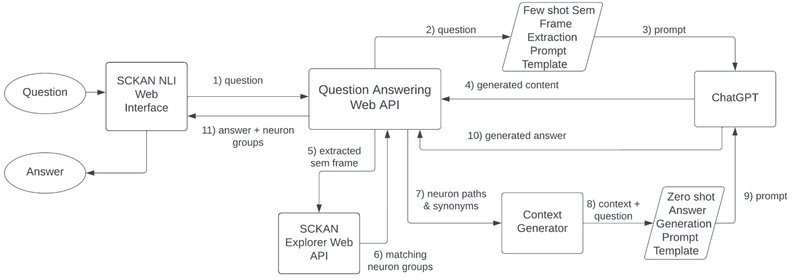

# Technical Approach of SCKAN NLI

The [SCKAN](https://sparc.science/tools-and-resources/6eg3VpJbwQR4B84CjrvmyD) Natural Language Interface (SCKAN NLI, [http://fdi-nlp.ucsd.edu/](http://fdi-nlp.ucsd.edu/)) is an AI-based query interface customized for retrieving high-level connectivity knowledge from SCKAN. The NLI leverages the [GPT-4o mini](https://platform.openai.com/docs/models/gpt-4o-mini) (“o” for “omni”) model to extract contextual semantic frames related to SCKAN's connectivity knowledge and generates answers using natural language expressions.

* Python FastAPI based REST API: [GitHub Link](https://github.com/SciCrunch/sckan_llm_nli_api/tree/main)
* MCP Server API: [GitHub Link](https://github.com/SciCrunch/sckan_explorer_mcp_api/tree/main)

## Core Technical Architecture

SCKAN NLI uses a semantic frame extraction strategy rather than direct SPARQL query generation. This approach was chosen because generating SPARQL queries directly from natural language proved unreliable due to SCKAN's complexity and size.

1. **Semantic Frame Extraction**:
   - Uses GPT-4 with few-shot learning to extract structured information from natural language questions
   - Identifies key semantic roles: soma location (origin), axon-terminal location (destination), and via location (intermediate path)
   - Recognizes additional filters like species, sex, and other phenotypes like parasympathetic or sympathetic connections.
2. **SCKAN Explorer API Integration**:
   - The extracted semantic frame is used to query SCKAN using the SCKAN Explorer API
   - Returns matching neuron population data from the knowledge base
3. **Retrieval-Augmented Generation (RAG)**:
   - The system augments LLM responses with specific knowledge retrieved from SCKAN
   - Creates context from matching neuron populations and their connectivity information
   - Generates natural language answers based on this retrieved information
   - Uses zero-shot learning for answer generation
4. **Higher-Level Structure Recognition**:
   - Recognizes higher-level anatomical structures (e.g., "cranial nerve nucleus" representing multiple nuclei)
   - Maps general terms to specific anatomical entities levargaing the hierarchical organization of the underlying ontologies in SCKAN

> Figure: SCKAN NLI Overview

## Query Processing Flow

When a user submits a question:

1. The natural language question is sent to the Question Answering API
2. The API sends the question to GPT-4 via a semantic frame extraction prompt template
3. The extracted semantic frame is used to query SCKAN KB via the SCKAN Explorer API
4. Connected anatomical structures and their synonyms are retrieved
5. Using RAG techniques, the system augments the query results to generate a prompt for GPT-4
6. GPT-4 generates a final natural language answer
7. The answer is processed and returned to the SCKAN-NLI interface

## Improving Accuracy of the Responses

The system employs several techniques to improve accuracy and capabilities:

- **Few-shot context learning** for semantic frame extraction
- **Zero-shot context learning** for answer generation
- Autocomplete suggestions for anatomical structures
- Feedback mechanisms for users to validate extraction accuracy and answers
- Support for four basic query types plus multiple variations
- Augmentation capabilities for customizing response formats

This approach allows users to query complex neural connectivity information without needing expertise in technical query languages, making the SCKAN knowledge base more accessible to researchers and domain experts.

## RAG Implementation in SCKAN NLI

The system uses a retrival-augmented generateion ([RAG](https://en.wikipedia.org/wiki/Retrieval-augmented_generation)) technique to enhance the quality and accuracy of responses by grounding the LLM's output in specific knowledge retrieved from SCKAN. Here's how RAG is used:

1. **Context Generation**:
   - After extracting the semantic frame from the user's question, the system queries the SCKAN KB to retrieve matching neuron populations
   - Connected anatomical structures and their synonyms are retrieved
   - This retrieved information forms the "context" that will be used to augment the LLM's response
2. **Prompt Construction with Retrieved Information**:
   - The system creates a zero-shot learning prompt that includes the retrieved SCKAN data
   - This prompt instructs the LLM (GPT-4) on how to use the retrieved information to generate an accurate answer
3. **Answer Generation Using Retrieved Context**:
   - GPT-4 generates responses using the retrieved connectivity data as factual context
   - This ensures responses are grounded in the actual data from SCKAN rather than the LLM's general knowledge

This RAG approach is central to how SCKAN NLI ensures its responses are accurate representations of the connectivity knowledge in SCKAN rather than potentially incorrect information from the LLM's training data.
