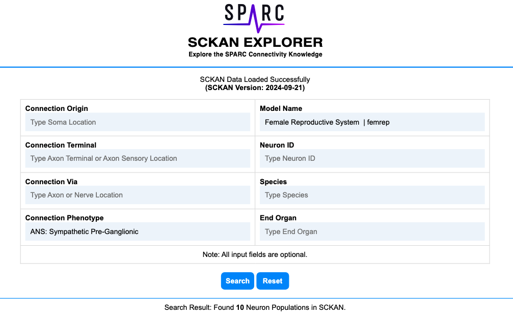
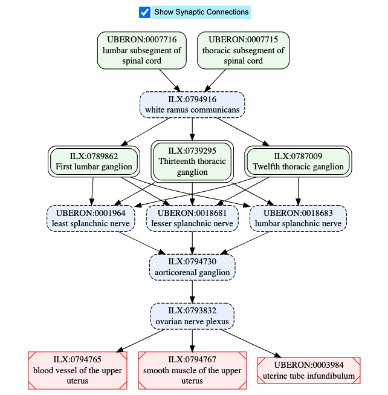
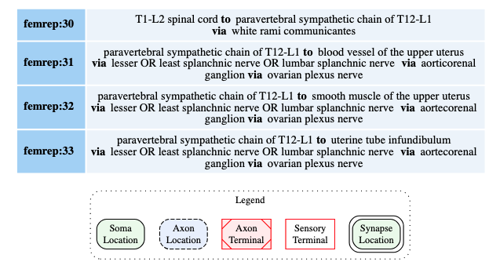

# About SCKAN Explorer

This repository contains the source code for the SCKAN Explorer. SCKAN Explorer ([https://services.scicrunch.io/sckan/explorer/](https://services.scicrunch.io/sckan/explorer/)) is a JavaScript-based intuitive search interface designed to explore [SCKAN](https://sparc.science/resources/6eg3VpJbwQR4B84CjrvmyD)’s neuron populations and their detailed connectivity information. It was developed as a proof of concept for SPARC investigators, anatomical experts, and knowledge curators to quickly check and verify existing SCKAN connections without the need to write SPARQL queries.

SCKAN Explorer (see Figure 1) facilitates flexible, streamlined data inputs by providing autocomplete suggestions for SCKAN-specific anatomical locations of the origin, terminal, and ‘via’ location fields within its interface. The autocomplete suggestions include standard anatomical terms along with their exact synonyms broadly used by the community ontologies like UBERON. The explorer also allows filtering the search results based on species, known neuron population IDs (or their fragments), as well as the end organs, also supported by autocomplete suggestions. The end organ filter can be used to retrieve the populations that terminate at any part of a given major organ (e.g., heart, prostate gland, urinary bladder). Additional search and filtering criteria include connection phenotypes (e.g., sympathetic, parasympathetic) and named connectivity models.

 

**Fig 1.** A screenshot of SCKAN Explorer’s input interface (top) and an example of a neuron population details returned (bottom). In this example, selecting `ANS:Sympathetic Pre-Ganglionic` as the connection phenotype and selecting `Female Reproductive System`as the model name returns 10 neuron populations from SCKAN.

SCKAN explorer also allows visualizing the detailed axonal pathways, including their synapses, whenever a neuron population has that knowledge available. For example, clicking the `Visualize` button next to the Population ID (see Figure 1 above), generates the visual diagrams as shown in Figure 2 below.

**Fig 2.** A screenshot of the generated visual diagram for an example neuron population (femrep:30) including its synaptic connectiosn terminating in different parts of the uterus.

## Limitations

SCKAN Explorer was developed as a proof-of-concept prototype for exploring SCKAN for SPARC curators, anatomical experts, and domain experts. This version is not intended for general audience. We are in the process of developing a version of SCKAN explorer more accessible for wider audience. Here we list the current limitations of SCKAN explorer:

* The users have to be specific about the connection origin, terminal, and via; i.e., SCKAN explorer currently does not support general terms that would intutitively include specific terms.
  * For instance, you need to specy a particular segment of the spinal cord like 'first cervical segment of spinal cord' or its synonym 'C1 segment' as the origin of a connection. You currently cannot ask the interface to list any connection(s) that originates at any segment of 'cerivcal spinal cord'.
  * Similarly, one cannot to ask to list the connection(s) that go through any of the cranial nerves; instead, you will have to select the specific cranial nerve from the auto-complete suggestions.
* The interface currently does not have the mechanism to save the results in CSV or any other format. Also, the interface does not have the mechanism to copy/share the url for any specific search results.
* The interface currently lists all the connections categorized by neuron populations only. The overall, region-region connections (regardless of the neuron populations forming  those connects) cannot be viewed.
* The axonal path diagrams (such as the one in Fig. 2) are only available for NLP-curated neuron populations. The populations from [ApINATOMY](https://scicrunch.org/sawg/about/ApiNATOMY) models are not visible at the moment. We are working on including those remaining diagrams for the next release of SCKAN.
