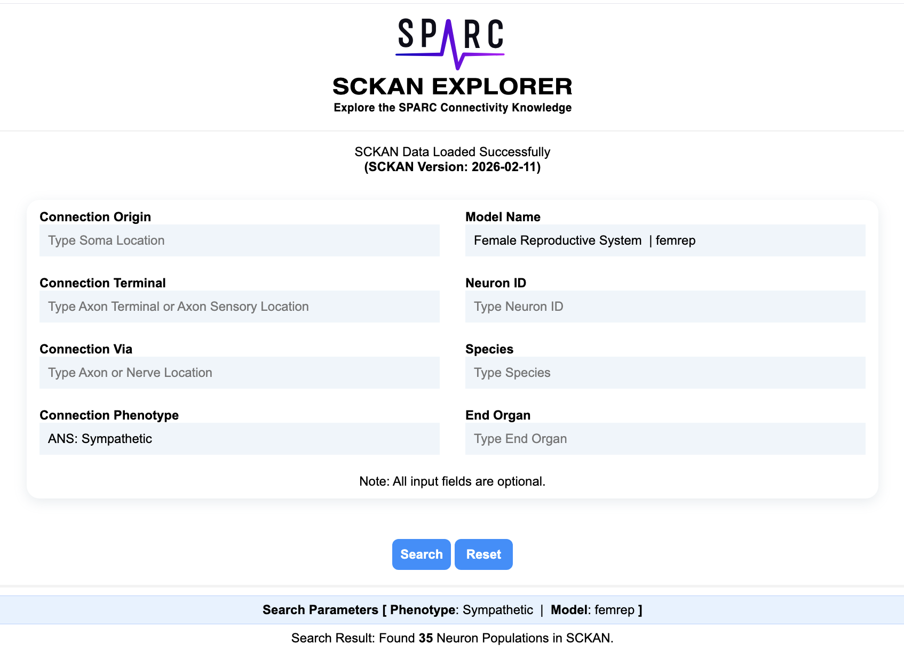
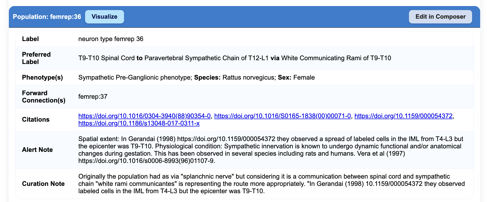
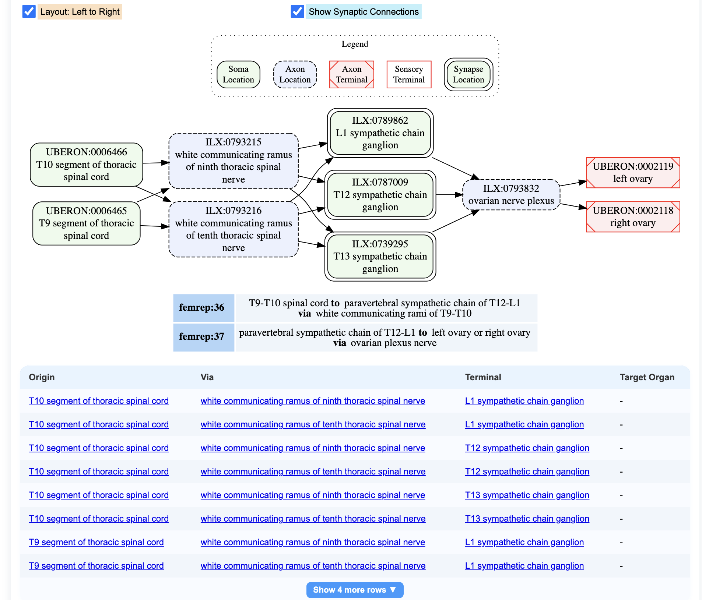

# About SCKAN Explorer

This repository contains the source code for the SCKAN Explorer. SCKAN Explorer ([https://services.scicrunch.io/sckan/explorer/](https://services.scicrunch.io/sckan/explorer/)) is a JavaScript-based intuitive search interface designed to explore [SCKAN](https://sparc.science/resources/6eg3VpJbwQR4B84CjrvmyD)’s neuron populations and their detailed connectivity information. It was developed as a proof of concept for SPARC investigators, anatomical experts, and knowledge curators to quickly check and verify existing SCKAN connections without the need to write SPARQL queries.

SCKAN Explorer (see Figure 1) facilitates flexible, streamlined data inputs by providing autocomplete suggestions for SCKAN-specific anatomical locations of the origin, terminal, and ‘via’ location fields within its interface. The autocomplete suggestions include standard anatomical terms along with their exact synonyms broadly used by the community ontologies like UBERON. The explorer also allows filtering the search results based on species, known neuron population IDs (or their fragments), as well as the end organs, also supported by autocomplete suggestions. The end organ filter can be used to retrieve the populations that terminate at any part of a given major organ (e.g., heart, prostate gland, urinary bladder). Additional search and filtering criteria include connection phenotypes (e.g., sympathetic, parasympathetic) and named connectivity models.

Recent Updates (February 28, 2026):

* You can now visualize synaptic pathways for all populations including the populations from expert-contributed ApiNATOMY models. Previously it was only possible to show the pathway diagrams for NLP-Curated populations.
* While the pathways are generated with top-to-bottom layout for the visualization, you now have the option to toggle the layout in left-to-right orientation. This often helps visualizing the sensory and motor connections in a more compact way.
* The URI links of the structures within the table view are now embedded within the names rather than having additional columns for them.
* You can now see the major target organ(s) of the terminal structures (axon terminal or sensory terminal) in the table view.
* You can now copy/share the search results using the parameterized URL.
* The explorer now has a direct edit button to edit/correct any population in Composer. Note: Editing in Composer requires ORCID-based authentication.

**Fig 1.** A screenshot of SCKAN Explorer’s input interface (top) and an example of a neuron population details returned (bottom). In this example, selecting `ANS:Sympathetic` as the connection phenotype and selecting `Female Reproductive System`as the model name returns 35 neuron populations from SCKAN.

**Fig 2.** SCKAN Explorer also allows visualizing the detailed axonal pathways, including their synapses, whenever a neuron population has that knowledge available. For example, clicking the `Visualize` button next to the Population ID (see Figure above) generates the visual diagrams as shown in Figure 3 below.

**Fig 3.** A screenshot of the generated visual diagram for an example neuron population (femrep:30) including its synaptic connections terminating in different parts of the uterus.

## Limitations

SCKAN Explorer was developed as a proof-of-concept prototype for exploring SCKAN for curators, anatomical experts, and domain experts. We are in the process of developing a version of SCKAN Explorer more accessible for a wider audience. Here we list the current limitations of SCKAN Explorer:

* Users have to be specific about the connection origin, terminal, and via; i.e., SCKAN Explorer currently does not support general terms that would intuitively include specific terms.
  * For instance, you need to specify a particular segment of the spinal cord like 'first cervical segment of spinal cord' or its synonym 'C1 segment' as the origin of a connection. You currently cannot ask the interface to list any connection(s) that originates at any segment of 'cervical spinal cord'.
  * Similarly, one cannot ask to list the connection(s) that go through any of the cranial nerves; instead, you will have to select the specific cranial nerve from the autocomplete suggestions.
* The interface currently does not have the mechanism to save the results in CSV or any other format.
* The interface currently lists all the connections categorized by neuron populations only. The overall region-region connections (regardless of the neuron populations forming those connections) cannot be viewed. While they can be viewed by SCKAN NLI, we plan to have this functionality available directly through SCKAN Explorer.
